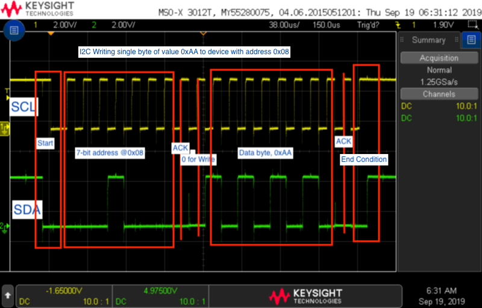

# Assignment 2 - Processor Communication
##### Author: Pooya Aghanoury

## How to run
Use 3 wires to connect Pi to Arduino for I2C (see online documentation on how this is done)
Compile code to Arduino, it should run without user intervention (obviously)
Connect a potentiometer to pin A2 on the Arduino for voltage value readings.

Run ```main.py``` via python3. It will prompt for user input.
- Entering an integer will have the arduino add 5 to the value and return it. The pi will then send this information to the LCD Display
- Entering a string will have the arduino return the reversed string. Pi will then send output to the display
- Enter the string "pot" will have the arduino return the Voltage reading from the potentiometer in two bytes, which will then be processed by the pi and sent to the display.
- Bonus: Enter the string "color", the program will then prompt for another input. Enter a series of rgb values to change the color of the display. Example: ```100 0 0``` will change the color to red.


## Question Responses
1. See code at bottom of page
2. 
3.  - The standard I2C data rate is 100 kbit/s. It is also capable of doing 400 kbit/s known as *fastmode*, 1 Mbit/s *Fast mode plus* and 3.4 Mbit/s *High Speed mode* and a slower 10 kbit/s *low-speed mode*
    - The maximum I2C speed one can acheive is 3.4 Mbit/s
    - You can use the Arduino library **Wire**
    - There is no maximum amount of bytes that can be transfered in a single transaction. However, most libraries will limit the transaction to 32 bytes


Main Program (python on Rpi)
```python
import board
import busio
from smbus2 import SMBus
import adafruit_character_lcd.character_lcd_rgb_i2c as character_lcd
import time

# init lcd screen
lcd_columns = 16
lcd_rows = 2
i2c = busio.I2C(board.SCL, board.SDA)
lcd = character_lcd.Character_LCD_RGB_I2C(i2c, lcd_columns, lcd_rows)

# set the LCD screen color to white 
# not PWM, anything greater than 1 turns that color channel completely on
lcd.color = [100, 100, 100]
lcd.message = "I2C Trash"


# for RPI version 1, use “bus = smbus.SMBus(0)”
# init i2c bus
bus = SMBus(1)
address = 0x08 #arduino address

# this function handles user data meant for sending
# we are using the i2c starting index value as a psuedo header
# so the arduino can know what kind of value is being sent

def sendToDuino(data):
    
    # if the data is an integer, send a single byte
    if isinstance(data, int):
        bus.write_byte_data(address, 0, data) 
        response = bus.read_byte_data(address,2)
        print("Response:", response)
        # write message to lcd
        lcd.clear()
        lcd.message = "sent: {}\ngot: {}".format(data, response)

    # if the incoming data is a string
    elif isinstance(data, str):

        # requesting for pot?
        if data == 'pot':
            # make a read request with header of 3
            response = bus.read_i2c_block_data(address, 3, 2)

            # we expect to get two bytes back. 
            # first is upper byte 16-bit analog reading
            # next is lower byte
            value = (response[0] << 8) + response[1]
            value = round(value/1023 * 5, 2)

            # write to lcd
            lcd.clear()
            lcd.message = str(value) + ' V'
            return
        try:

            # attempt to write bytes to arduino
            byte_array = [ord(i) for i in data]
            bus.write_i2c_block_data(address, 1, byte_array)
            # time.sleep(0.1) # questionable delay

            # get the response
            response = bus.read_i2c_block_data(address, 2,len(byte_array))
            payload = ''

            #convert bytes to array chars (string)
            for i in response:
                payload += chr(i)
        except:

            # if something failes in the read/write process
            # Set payload
            print("Failed to do something useful")
            payload = 'Failed to \nsend/receive'
            
        # update lcd
        lcd.clear()
        lcd.message = payload
        # except:


while True:
    var = input("Enter an int or string: ")

    # check for command inputs
    if var == 'color':
        color = input("Enter a sequence of rgb values: ")
        color = color.split(' ')
        color_vals = [int(i) for i in color]
        lcd.color = color_vals

    elif var == 'clear':
        lcd.clear()
    elif var == 'exit':
        exit()

    # else: processes generic input
    else:
        #attempt conversion to int, otherwise send out string
        try:
            data = int(var)
        except:
            data = var

        # send data out
        sendToDuino(data)
    
```

Arduino
```c++
#include <Wire.h>


int analogPin = A2;
uint16_t pot_value = 0;
uint8_t pot_regs[2]= {0};


// globals

// allocate an array of 100 bytes 
uint8_t c[100] = {0};
int payload_size = 0;
int global_payload_size = 0;
uint8_t buff[100] = {0};
uint8_t return_sum = 0;
char return_mode = 'n';


void setup() {
  Wire.begin(8);                // join i2c bus with address #8
  Wire.onReceive(receiveEvent); // register event
  Wire.onRequest(requestEvent);
//  Serial.begin(9600);
}

void loop() {
  pot_value = analogRead(analogPin);
  pot_regs[0] = pot_value >> 8;
  pot_regs[1] = pot_value;
//  Serial.print(pot_regs[0]);
//  Serial.print(' ');
//  Serial.println(pot_regs[1]);
}

// function that executes whenever data is requested by master
// this function is registered as an event, see setup()
void receiveEvent() {
  
  int i = 0;
  int header = Wire.read();
  payload_size = Wire.available();
 
  
  if (header == 0) {
    return_mode = 's';
    return_sum = Wire.read() + 5;
  }
  else if (header == 1) {
    return_mode = 'a';
    
    while(Wire.available()) {
      c[i] = uint8_t(Wire.read());  
//      Serial.println(c[i]);
      i++;
    }
    global_payload_size = payload_size;
  }
  else if(header == 2) return;
  else if(header == 3) {
    c[0] = pot_value >> 8;
    c[1] = pot_value;
    global_payload_size = 2;
    return_mode = 'v';
  }


  
//  Serial.println("---------------");

}

void requestEvent() {
//  Serial.println(return_mode); 
  if (return_mode == 'n') return;
  //for single bytes
  else if (return_mode == 's') {
    Wire.write(return_sum);
  }
  else if (return_mode == 'a') {

    uint8_t tmp_buff[global_payload_size];
    for (int i = 0; i < global_payload_size; i++) {
       tmp_buff[i] = c[global_payload_size - 1 - i];
//       Serial.println(c[i]);
    }
    Wire.write(tmp_buff, global_payload_size);
  }
  else if (return_mode == 'v') {
    uint8_t tmp_buff[global_payload_size];
    for (int i = 0; i < global_payload_size; i++) {
       tmp_buff[i] = c[i];
//       Serial.println(c[i]);
    }
    Wire.write(tmp_buff, global_payload_size);
  }
  
  global_payload_size = 0;
//  Serial.println("Responded");
}

```